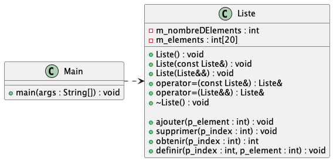
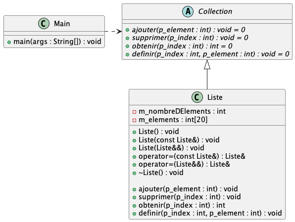

# Module 03 - POO en C++

## Exercice 1 - On fait un hello world en POO !

Le but de cet exercice est de créer une première classe en C++ et de l'utiliser dans un programme.

Créez une classe `Personne` avec les attributs suivants :

- `nom` de type `string`
- `prenom` de type `string`
- `age` de type `int`
- `taille` de type `float`

- Créez un constructeur qui initialise les attributs avec des valeurs passées en paramètres
- Créez le constructeur par copie
- Créez le constructeur de déplacement
- Créez un destructeur
- Créez les opérateurs d'affectation (& et &&)
- Créez des accesseurs et des mutateurs (get/set) pour le nom, le prénom et la taille (get seulement)
- Créez une méthode `afficher()` qui affiche les attributs de la classe `Personne`.
- Créez une méthode `feterAnniversaire()` qui incrémente l'attribut `age` de la classe `Personne`
- Créez une méthode `grandir()` qui incrémente l'attribut `taille` de la classe `Personne`

Chaque méthode doit afficher un message dans la console pour indiquer son exécution.

Dans le main, faîtes les tests suivants :

- Essayez de créer une instance de la classe `Personne` avec le constructeur par défaut : que se passe-t-il ?
- Créez une instance de la classe `Personne` avec le constructeur qui prend des paramètres
- Utilisez le constructeur par copie pour créer une nouvelle instance de la classe `Personne`
- Utilisez l'opérateur d'affectation pour créer une nouvelle instance de la classe `Personne` à partir d'une lvalue
- Utilisez l'opérateur d'affectation pour créer une nouvelle instance de la classe `Personne` à partir d'une rvalue
- Appelez la méthode `afficher()` sur chaque instance de la classe `Personne`

## Exercice 2 - Liste simple

Le but de cet exercice est de créer une classe `Liste` qui permet de stocker des entiers. Cette classe doit permettre d'ajouter des entiers, de les supprimer, etc.

Votre liste pourra avoir un maximum de 20 entiers.

Votre classe doit contenir les attributs suivants :

- `m_nombreDElements` de type `int` qui représente le nombre d'éléments dans la liste
- `m_elements` de type `int[20]` qui représente les éléments de la liste

Votre classe doit contenir les méthodes suivantes :

- `ajouter(int p_element)` qui ajoute un élément à la fin de la liste si elle n'est pas pleine. Sinon lever une exception.
- `supprimer(int p_index)` qui supprime un élément de la liste à l'index `p_index` si l'index existe. Sinon lever une exception
- `obtenir(int p_index)` qui retourne l'élément à l'index `p_index` si l'index existe. Sinon lever une exception
- `definir(int p_index, int p_element)` qui définit l'élément à l'index `p_index` avec la valeur `p_element` si l'index existe. Sinon lever une exception

Dans le main, faîtes les tests suivants :

- Créez une instance de la classe `Liste`
- Ajoutez 5 éléments à la liste
- Affichez les éléments de la liste
- Supprimez le 3ème élément de la liste
- Affichez les éléments de la liste
- Définissez le 2ème élément de la liste avec la valeur 42
- Affichez les éléments de la liste
- Définissez le 10ème élément de la liste avec la valeur 42 : que se passe-t-il ?
- Supprimez le 10ème élément de la liste : que se passe-t-il ?
- Ajoutez 20 éléments à la liste : que se passe-t-il ?

## Exercice 3 - Ajout d'abstraction

Le but de cet exercice est de créer une classe `Collection` qui permet d'abstraire la classe `Liste` de l'exercice précédent. Cette classe doit permettre d'ajouter des entiers, de les supprimer, etc.

Vous devez extraire les méthodes de la classe `Liste` et les donner comme interface à la classe `Collection` et faire en sorte que la classe `Liste` hérite de la classe `Collection`. La classe `Collection` doit être abstraite. Déclarez et définissez explicitement un constructeur par défaut, par copie et de déplacement et un destructeur pour la classe `Collection`. Ces méthodes doivent afficher un message dans la console pour indiquer leur exécution.

Dans le main, faîtes les tests suivants :

- Créez une instance de la classe `Liste` et affectez là à une variable de type référence de `Collection`
- Refaites les tests de l'exercice précédent
